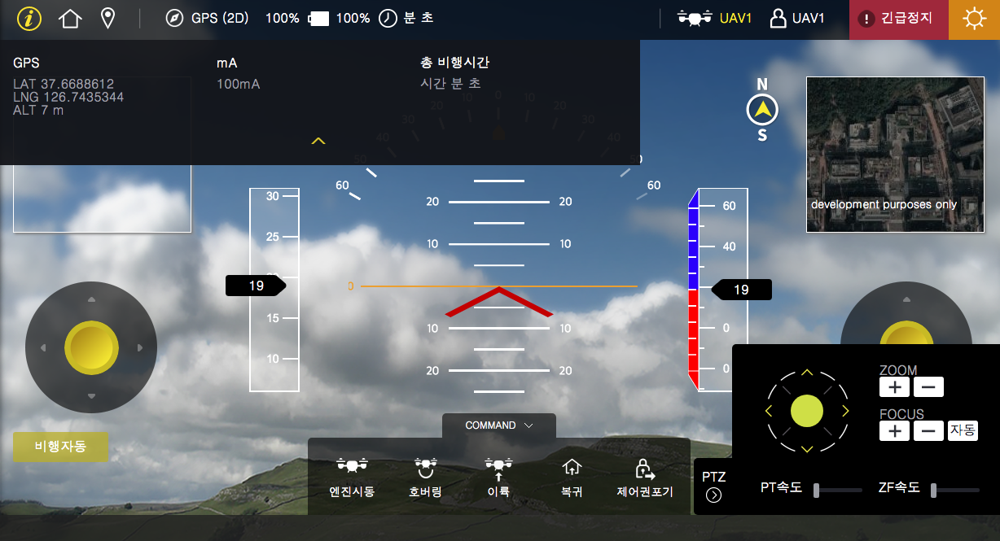
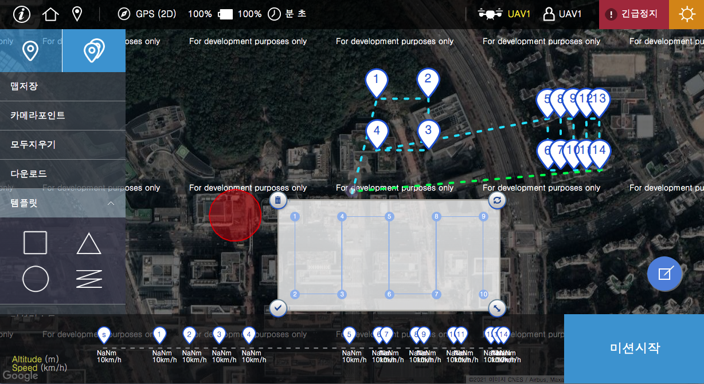

## 드론 조종기 및 미션 생성기 어플리케이션을 개발
- angular 프레임워크를 사용하여 만들고 cordovar 어플 생성
- target = ios, android, window폰

## 기능

### 드론 조종화면

> 조종기(이륙,창륙,복귀등), 비행상태 표시(고도,속도,위치등), 카메라 제어 등

### 미션 설정 화면

> 드론이동 경로 설정기능
>
> 미션에 대한 템플릿 제공 및 커스텀 기능 제공
>
> google map api 사용하여 위치 및 UI 적용
